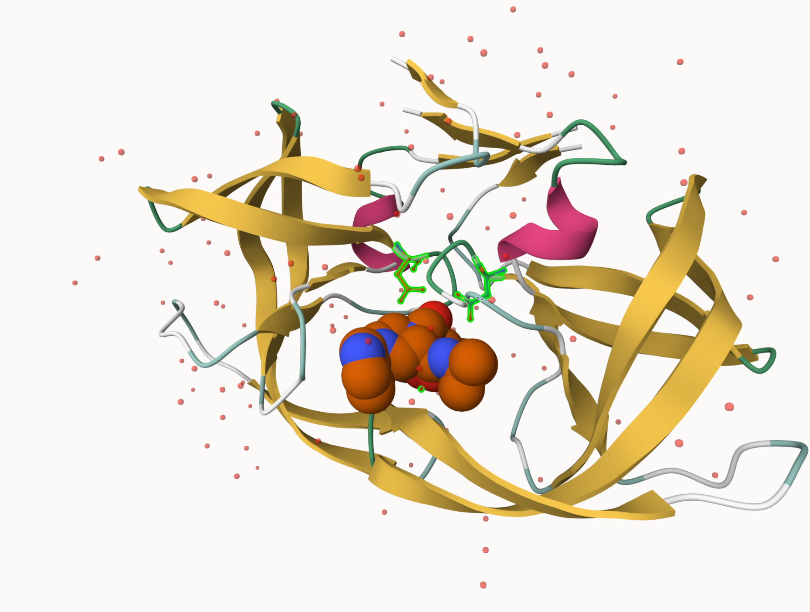
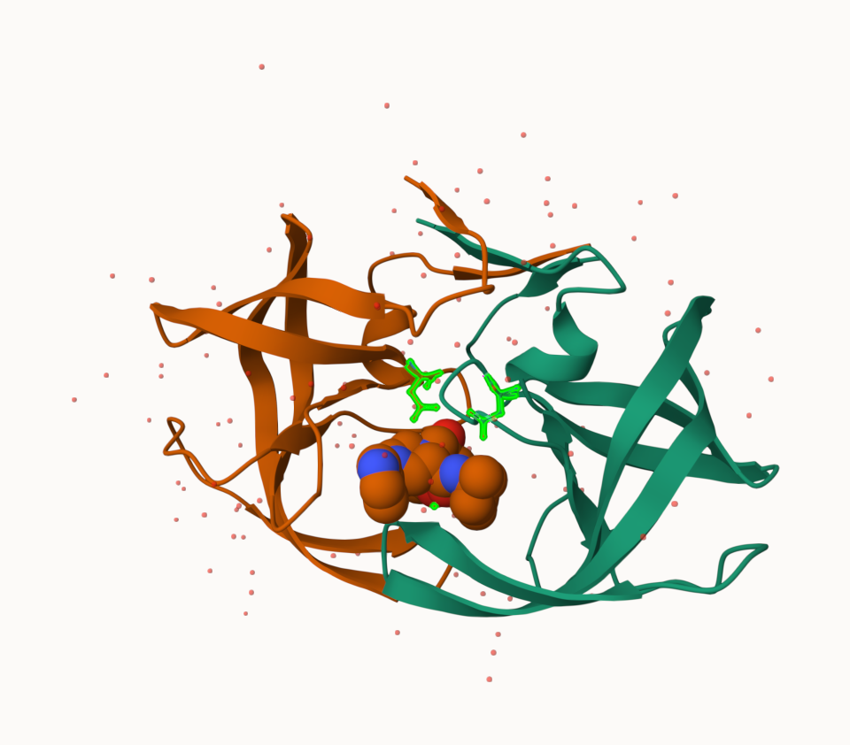

**Structural Bioinformatics (Pt.1)**

**Q1: What percentage of structures in the PDB are solved by X-Ray and Electron Microscopy.**

80.5% of the structures in PDB are solved by X-Ray and 13.4% are solved by Electron Microscopy. 

**Q2: What proportion of structures in the PDB are protein?**
97.9% of the structures in PDB contain protein

**Q3: Type HIV in the PDB website search box on the home page and determine how many HIV-1 protease structures are in the current PDB?**

There are 1,227 HIV-1 protease structures in the current PDB

**3. Visualizing the HIV-1 protease structure**

**Saving an Image**
{width=60%}

**Q4: Water molecules normally have 3 atoms. Why do we see just one atom per water molecule in this structure?**

We see just one atom per water molecule in this structure because the water molecules are represented by a single oxygen atom in the structure. In X-Ray crystal strcutres only one oxygen atom is normally visible since hydrogen atoms are smaller and harder to detect.

**Q5: There is a critical “conserved” water molecule in the binding site. Can you identify this water molecule? What residue number does this water molecule have**

The conserved water molecule in the binding site is HOH308.

**Q6: Generate and save a figure clearly showing the two distinct chains of HIV-protease along with the ligand. You might also consider showing the catalytic residues ASP 25 in each chain and the critical water (we recommend “Ball & Stick” for these side-chains). Add this figure to your Quarto document.**
{width=60%}

**Discussion Topic: Can you think of a way in which indinavir, or even larger ligands and substrates, could enter the binding site?**

Larger ligands such as indinavir can access the binding site through conformational changes in this HIV-1 protease. The flap regions of the enzyme transiently open which can create space for the ligand to enter the active site. It can also close to allow proper binding and positioning. 

**4. Introduction to Bio3D in R**

```{r}
#Loading bio3d
library(bio3d)
```

```{r}
#Reading and inspect on-line file with PDB Id 1HSG
pdb <- read.pdb("1hsg")
```

```{r}
#Generating summary of the contents of the pdb object
pdb
```

**Q7: How many amino acid residues are there in this pdb object?**

There are 198 amino acid residues in this pdb object

**Q8: Name one of the two non-protein residues?**

One of the two non-protein residues is MK1

**Q9: How many protein chains are in this structure?**

There are two protein chains in this structure 

```{r}
#Finding attributes of any such object
attributes(pdb)
```

```{r}
#Accessing the atom attribute or component
head(pdb$atom)
```


```{r}
#Loading respective packages and generate a quick NGL structure
#overview of a bio3d pdb class object with a number of simple defaults
library(bio3dview)
library(NGLVieweR)
#Viewing the pdb structure 
view.pdb(pdb) |>
  setSpin()
```

```{r}
# Select the important ASP 25 residue
sele <- atom.select(pdb, resno=25)

# and highlight them in spacefill representation
view.pdb(pdb, cols=c("navy","teal"), 
         highlight = sele,
         highlight.style = "spacefill") |>
  setRock()
```

**Predicting Functional Motions of a Single Structure**

```{r}
#Reading a new PDB structure of Adenylate Kinase
adk <- read.pdb("6s36")
```

```{r}
#Running adk
adk
```

```{r}
# Perform flexiblity prediction
m <- nma(adk)
```

```{r}
#Generating plot for the NMA results 
plot(m)
```

```{r}
#Generating molecular "trajectory"
mktrj(m, file="adk_m7.pdb")
```

```{r}
#Quick display of molecular "trajectory" using view.nma() from bio3dview package
view.nma(m, pdb=adk)
```

**5. Comparative structure analysis of Adenylate Kinase**

**Q10. Which of the packages above is found only on BioConductor and not CRAN?**

The package above that is found only on BioConductor and not CRAN is msa.

**Q11. Which of the above packages is not found on BioConductor or CRAN?**

The bio3dview package is not found on BioConductor or CRAN.

**Q12. True or False? Functions from the pak package can be used to install packages from GitHub and BitBucket?**

TRUE

**Search and retrieve ADK structures**

```{r}
#Loading the bio3d package
library(bio3d)
#Retrieving the amino acid sequence for chain A of PDB entry 1ake 
aa <- get.seq("1ake_A")
```

```{r}
#Viewing the retrieved sequence
aa
```

**Q13. How many amino acids are in this sequence, i.e. how long is this sequence?** 

There are 214 amino acids in this sequence

```{r}
#BLAST the ADK sequence against the PDB database to find similar structures
b <- blast.pdb(aa)
```

```{r}
#Plot and filter the BLAST results to identify top hits
hits <- plot(b)
```

```{r}
# List out some 'top hits'
head(hits$pdb.id)
```

```{r}
hits <- NULL
hits$pdb.id <- c('1AKE_A','6S36_A','6RZE_A','3HPR_A','1E4V_A','5EJE_A','1E4Y_A','3X2S_A','6HAP_A','6HAM_A','4K46_A','3GMT_A','4PZL_A')
```

```{r}
# Download releated PDB files
files <- get.pdb(hits$pdb.id, path="pdbs", split=TRUE, gzip=TRUE)
```

```{r}
# Align releated PDBs
pdbs <- pdbaln(files, fit = TRUE, exefile="msa")
```

**Optional: Viewing our superposed structures**

```{r}
#Loading the bio3dview package 
library(bio3dview)
#Displaying the retrieved PDB structures in 3D
view.pdbs(pdbs)
```

```{r}
#Loading the bio3dview package 
library(bio3dview)
#Displaying the retrieved PDB structures in 3D
view.pdbs(pdbs, colorScheme = "residueIndex")
```

**Annotate collected PBD structures**

```{r}
# Vector containing PDB database codes
ids <- basename.pdb(pdbs$id)

anno <- pdb.annotate(ids)
unique(anno$source)
```

```{r}
#Viewing available annotation data
anno
```

```{r}
# Perform PCA
pc.xray <- pca(pdbs)
plot(pc.xray)
```

```{r}
# Calculate RMSD
rd <- rmsd(pdbs)

# Structure-based clustering
hc.rd <- hclust(dist(rd))
grps.rd <- cutree(hc.rd, k=3)

plot(pc.xray, 1:2, col="grey50", bg=grps.rd, pch=21, cex=1)
```

**PCA visualization**

```{r}
# Visualize first principal component
pc1 <- mktrj(pc.xray, pc=1, file="pc_1.pdb")
```

```{r}
#Viewing results with bio3dview view() function
view.pca(pc.xray)
```

```{r}
#Plotting results with ggplot2
library(ggplot2)
library(ggrepel)

df <- data.frame(PC1=pc.xray$z[,1], 
                 PC2=pc.xray$z[,2], 
                 col=as.factor(grps.rd),
                 ids=ids)

p <- ggplot(df) + 
  aes(PC1, PC2, col=col, label=ids) +
  geom_point(size=2) +
  geom_text_repel(max.overlaps = 20) +
  theme(legend.position = "none")
p
```

**6. Normal mode analysis**

```{r}
# NMA of all structures
modes <- nma(pdbs)
```

```{r}
#Plot fluctuations across residues for all structures
plot(modes, pdbs, col=grps.rd)
```

**Q14. What do you note about this plot? Are the black and colored lines similar or different? Where do you think they differ most and why?**

The plot has similar trends, but the red and green lines have higher peaks. The black and colored lines share the same overall shape, but the colored lines have more fluctuations. The colored lines fluctuate more around residues 125-150, which suggests that this region has increased flexibility.