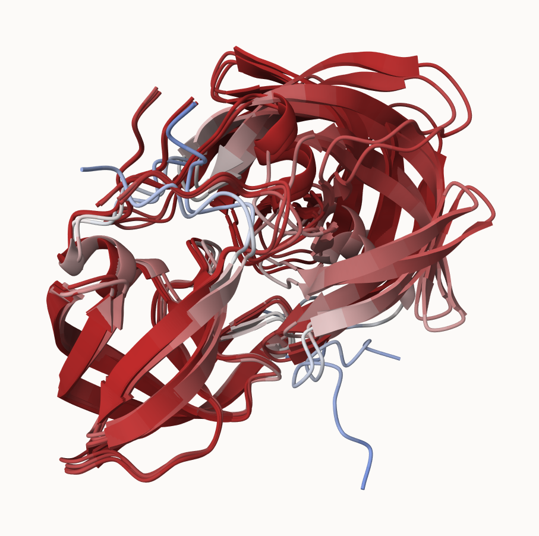

**Figure 18**

{fig-align="center" width=70%}

Figure: Superposed monomer models

**8. Custom analysis of resulting models**

```{r}
# Set the folder with PDB model files
results_dir <- "~/Downloads/hivprdimer_23119/"
```

```{r}
# Get all PDB files from the results folder
pdb_files <- list.files(path=results_dir,
                        pattern="*.pdb",
                        full.names = TRUE)
# Print PDB file names
basename(pdb_files)
```

```{r}
library(bio3d)

# Read all data from Models 
#  and superpose/fit coords
pdbs <- pdbaln(pdb_files, fit=TRUE, exefile="msa")
```

```{r}
#Reading and aligning PDB structures
pdbs
```

```{r}
#Calculating the RMSD betweena all pairs models with rmsd()
rd <- rmsd(pdbs, fit=TRUE)
#Showing the range of RMSD values between models
range(rd)
```

```{r}
#Generating heatmap of RMSD matrix values
#Loading the pheatmap package
library(pheatmap)
#Assigning column names to each model
colnames(rd) <- paste0("m",1:5)
#Assigning row names to each model
rownames(rd) <- paste0("m",1:5)
#Plotting the RMSD heatmap
pheatmap(rd)
```

```{r}
# Read a reference PDB structure
pdb <- read.pdb("1hsg")
```

```{r}
# Ploting B-factor/flexibility values for model 1
plotb3(pdbs$b[1,], typ="l", lwd=2, sse=pdb)
# Adding model 2 B-factor values to the plot
points(pdbs$b[2,], typ="l", col="red")
#Adding model 3 B-factor values to the plot
points(pdbs$b[3,], typ="l", col="blue")
#Adding model 4 B-factor values to the plot
points(pdbs$b[4,], typ="l", col="darkgreen")
#Adding model 5 B-factor values to the plot
points(pdbs$b[5,], typ="l", col="orange")
#Adding a vertical reference line at residue position 100
abline(v=100, col="gray")
```

```{r}
#Improving supersition/fitting of models by finding the most "rigid core" common
#Across all the models
core <- core.find(pdbs)
```

```{r}
#Write out the fitted structures to corefit_structures directory
core.inds <- print(core, vol=0.5)
```

```{r}
xyz <- pdbfit(pdbs, core.inds, outpath="corefit_structures")
```

{fig-align="center" width=70%}
Figure 19


```{r}
rf <- rmsf(xyz)

plotb3(rf, sse=pdb)
abline(v=100, col="gray", ylab="RMSF")
```

**Predicted Alignment Error for domains**

```{r}
library(jsonlite)

# Listing of all PAE JSON files
pae_files <- list.files(path=results_dir,
                        pattern=".*model.*\\.json",
                        full.names = TRUE)
```

```{r}
pae1 <- read_json(pae_files[1],simplifyVector = TRUE)
pae5 <- read_json(pae_files[5],simplifyVector = TRUE)

attributes(pae1)
```

```{r}
# Per-residue pLDDT scores 
#  same as B-factor of PDB..
head(pae1$plddt) 
```

```{r}
pae1$max_pae
```

```{r}
pae5$max_pae
```

```{r}
plot.dmat(pae1$pae, 
          xlab="Residue Position (i)",
          ylab="Residue Position (j)")
```

```{r}
plot.dmat(pae5$pae, 
          xlab="Residue Position (i)",
          ylab="Residue Position (j)",
          grid.col = "black",
          zlim=c(0,30))
```

```{r}
plot.dmat(pae1$pae, 
          xlab="Residue Position (i)",
          ylab="Residue Position (j)",
          grid.col = "black",
          zlim=c(0,30))
```

**Residue conservation from alignment file**

```{r}
aln_file <- list.files(path=results_dir,
                       pattern=".a3m$",
                        full.names = TRUE)
aln_file
```

```{r}
aln <- read.fasta(aln_file[1], to.upper = TRUE)
```

```{r}
dim(aln$ali)
```

```{r}
sim <- conserv(aln)
```

```{r}
plotb3(sim[1:99], sse=trim.pdb(pdb, chain="A"),
       ylab="Conservation Score")
```

```{r}
con <- consensus(aln, cutoff = 0.9)
con$seq
```

```{r}
m1.pdb <- read.pdb(pdb_files[1])
occ <- vec2resno(c(sim[1:99], sim[1:99]), m1.pdb$atom$resno)
write.pdb(m1.pdb, o=occ, file="m1_conserv.pdb")
```

{fig-align="center" width=70%}

Figure 20